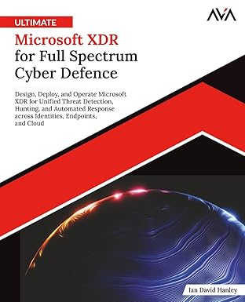

# KQL Toolbox

**Production-Grade Kusto Queries for Microsoft Sentinel & Defender**

This repository is the **official companion** to the *KQL Toolbox* book series.

It contains **curated, stable, production-ready KQL queries** designed to help security teams reduce noise, control ingest cost, improve detection fidelity, and make defensible decisions using Microsoft Sentinel and Defender data.

This is **not** an experimental query playground.
Every query here has survived real environments.

<br/>

## 🎯 Purpose of This Repository

Most KQL libraries optimize for *volume*.

**KQL Toolbox optimizes for judgment.**

This repo exists to:

* Provide **copy/paste-clean** KQL you can trust
* Align queries directly to **architectural decisions**
* Support **repeatable security outcomes**, not dashboards for their own sake
* Serve as a stable reference that matches the book’s maturity arc

If a query lives here, it earned its place.

<br/>

## 🧭 How This Repo Is Organized

The repository mirrors the structure of the *KQL Toolbox* book.

```
Repo/
├── KQL Toolbox #1: Visualize & Price your Billable Ingest Trends/
├── KQL Toolbox #2: Find Your Noisiest Log Sources (With Cost)/
├── KQL Toolbox #3: Which Event ID Noises Up Your Logs (and Who’s Causing It)?/
├── KQL Toolbox #4: What Changed? Finding Log Sources with the Biggest Delta in Volume & Cost/
...
```

<br/>

## 📘 Relationship to the Book

The *KQL Toolbox* book provides:

* The **why**
* The tradeoffs
* The mental models
* The decision surfaces

This repository provides:

* The **how**
* The exact queries
* A maintained, versioned reference point

The book stands on its own.
This repo makes it *operationally useful*.

<br/>

## 🔁 Versioning & Stability

* Queries are versioned alongside book releases
* Breaking changes are documented in the `CHANGELOG.md`
* Queries are **not silently modified**
* Older versions remain accessible for reference

If a query changes here, it changes *for a reason*.

<br/>

## ⚠️ What This Repo Is *Not*

To avoid confusion, this repository is deliberately **not**:

* A dumping ground for exploratory queries
* A complete catalog of every KQL pattern imaginable
* A replacement for broader KQL libraries
* A beginner tutorial

For experimental, in-progress, or exploratory KQL, see my main KQL library instead.

<br/>

## 🛠 Prerequisites & Assumptions

Most queries assume:

* Microsoft Sentinel or Defender XDR
* Familiarity with core KQL concepts
* An environment producing meaningful telemetry

These queries favor **signal clarity over convenience**.

<br/>

## 🧠 Intended Audience

This repo is written for:

* Security architects
* Detection engineers
* SOC leads
* Platform owners
* Anyone responsible for defending *why* a detection exists

If you’re looking for “top 10 KQL tricks,” this is probably not it.
If you’re accountable for outcomes, you’re in the right place.

<br/>

## 🔑 License

See `LICENSE` for usage terms.

You are free to use these queries in your environments.
Attribution is appreciated, but discipline is required.

<br/>

## 📝 Final Note

KQL doesn’t fail teams.
**Undisciplined questions do.**

This repo exists to help you ask better ones.

<br/>

## ⚡ More from DevSecOpsDad

<div style="text-align:left; margin: 2.5em 0;">
    <p style="margin-top: 0.75em; font-size: 0.95em; opacity: 0.85;">
    🔗 <strong>DevSecOpsDad</strong><br/>
    Microsoft XDR, KQL, real-world security engineering, and other fun stuff from DevSecOpsDad, your friendly neighbourhood Attack Surface Samurai.
  </p>
  <a href="https://www.devsecopsdad.com" target="_blank" rel="noopener noreferrer">
    
  </a>
  </div>

<br/><br/>

<div style="text-align:left; margin: 2.5em 0;">
    <p style="margin-top: 0.75em; font-size: 0.95em; opacity: 0.85;">
    📘 <strong>Ultimate Microsoft XDR for Full Spectrum Cyber Defense</strong>
  </p>
  <a href="https://a.co/d/4vveVCI" target="_blank" rel="noopener noreferrer">
    
  </a>
  </div>

<br/><br/>

<div style="text-align:center; margin: 2.5em 0;">
    <p style="margin-top: 0.75em; font-size: 0.95em; opacity: 0.85;">
    📘 <strong>PowerShell Toolbox: Hands-On Automation for Auditing and Defense
  </p>
  <a href="https://a.co/d/ifIo6eT" target="_blank" rel="noopener noreferrer">
    
  </a>
</div>


